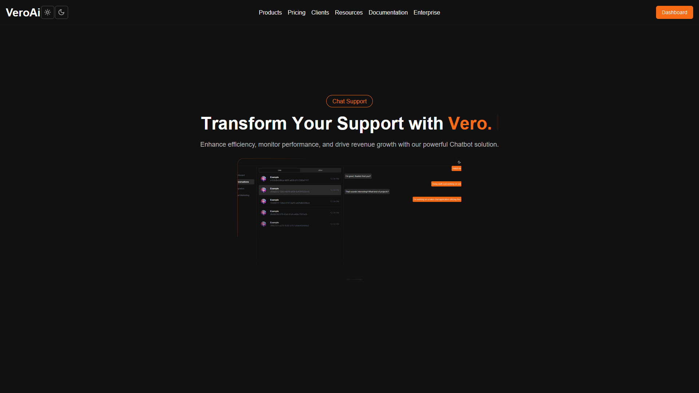

# 🌟 VeroAi

Welcome to **VeroAi**! An innovative AI sales chat solution designed to empower companies in guiding customers and boosting sales. With VeroAi, live support can seamlessly monitor conversations and step in when needed. Plus, it enables efficient information harvesting, such as collecting various data types for effective marketing campaigns.

> **⚠️ Current Status**: VeroAi is still **heavily under construction**. We're working diligently to enhance its capabilities and features. Stay tuned for updates!

---

## 🚀 **Features**

- **AI-Powered Chat**: Engage customers in real-time with intelligent chat responses.
- **Live Support Monitoring**: Allow support teams to watch conversations and intervene as necessary.
- **Data Collection**: The AI can be trained to collect and sort various types of data, including:
  - **Emails**: Gather emails for targeted email marketing campaigns.
  - **Customer Preferences**: Understand customer needs and tailor interactions accordingly.
  - **Feedback and Reviews**: Collect valuable feedback to improve products and services.
  - **Lead Information**: Capture potential customer details for sales follow-ups.
- **Specialization in Various Genres**: The AI can be customized to specialize in different sectors or industries, enhancing its relevance and effectiveness.
- **User-Friendly Interface**: Built with a focus on usability and accessibility.

---

## 🛠️ **Tech Stack**

| Tool                                                                                                               | Description                                                  | Link                                                |
|--------------------------------------------------------------------------------------------------------------------|--------------------------------------------------------------|-----------------------------------------------------|
|                   | Building dynamic and interactive user interfaces with React  | [React Official](https://reactjs.org/)              |
|             | For server-side rendering and static site generation with Next.js | [Next.js Official](https://nextjs.org/)             |
|             | NoSQL database for flexible data storage                    | [MongoDB Official](https://www.mongodb.com/)        |
|  | For beautiful and responsive design                          | [Tailwind CSS Docs](https://tailwindcss.com/)        |
|    | Enhancing code quality and maintainability with TypeScript  | [TypeScript Official](https://www.typescriptlang.org/) |
|                 | For real-time communication capabilities                     | [Pusher Official](https://pusher.com/)               |
|        | A component library for modern user interfaces              | [Shadcn UI Docs](https://shadcn.dev/)                |

---

## 📸 **Screenshots**
Here’s a glimpse of what VeroAi looks like:

### Conversation Interface

### Hero Section

---

## 💬 **Get Involved**
We welcome contributions! If you're interested in helping out, feel free to check out the issues or submit a pull request.

Thank you for checking out **VeroAi**! We’re excited to transform the way businesses interact with customers. 🚀
